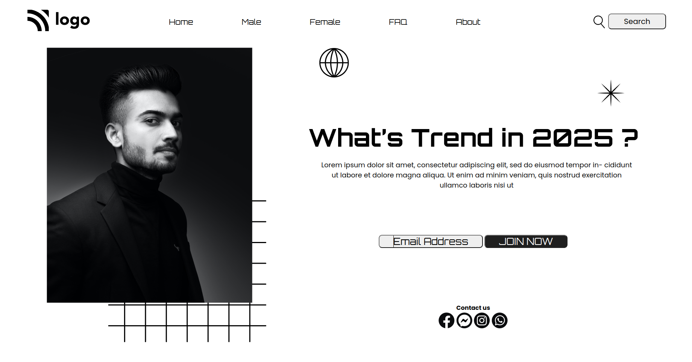

## My Name

### JYOTI SINGH

## PROJECT NAME

### Street Style Landing Page

## About

- ### Used HTML And CSS.
- ### Style by Positioning and flex-box seperatly.
- ### Laptop Based ,not responsive.

## WHAT I LEARN FROM THIS PROJECT?

- ### This is my first project and the special one in which i tried so hard to complete it .
- ### I learned so much from this project,where i worked firstly with positioning and done the same project with flex-box also.
- ### Besides the topic i learned that nothing is impossible , all we have to do is to just start no matter what will be outcome.

## TIME TAKEN TO COMPLETE

- ### With positioning it takes 1 day
- ### With flex-box it takes 3-4 hour

## PHOTOS

### WEBSITE LINK

[Visit Link](https://street-style1.netlify.app/)
